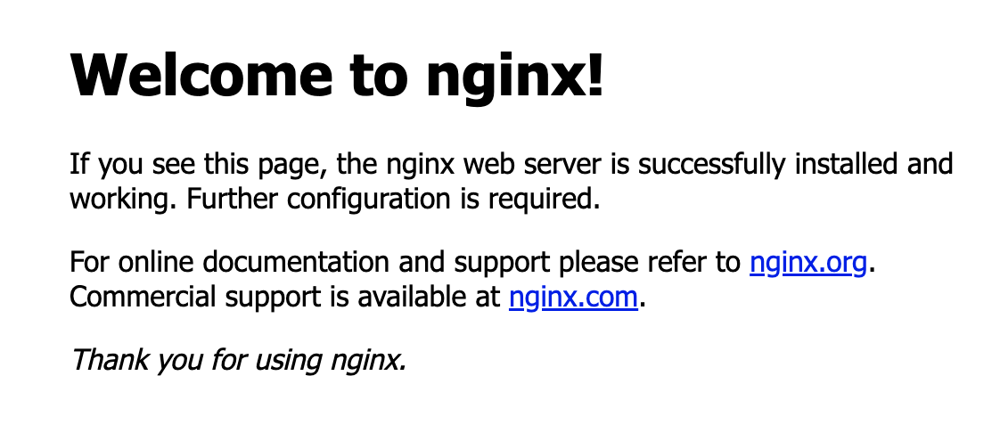

# Kubernetes

* To install minikube and kubectl, follow this document:
https://minikube.sigs.k8s.io/docs/handbook/kubectl/

* Make sure Docker Daemon is active (open Docker Desktop)

* kubectl is the command line for K8s
* miikube is the cluster itself, running in Docker (for localdev)

* To deploy a demo app:
    * 1. Paste the yaml file in VS Code
    * 2. In terminal, run **kubectl apply -f <yaml file name>.yaml**
        *To check the status of running pod, **kubectl get pod*** 
        * To delete pod: *kubectl delete <pod name>*

* To log in and check the content of a cluster:
    * minikube ssh
    * curl http://<IP>

* Kubernetes objects are always 
    * kubectl describe <resource-type> <resource-name> | kuberctl describe pod <name of pod>

* Tthe Auto Scaling and Auto Healing capability is enabled in Deployment (wrapper)

* **Best practice**: In production, avoid :latest. Pin a specific NGINX version (e.g. nginx:1.28 or nginx:1.28.0-alpine) so rollouts are predictable and you control when upgrades happen.

* A .yaml file must have these 4 components:
    * apiVersion
    * kind
    * metadata
    * spec

* Kubectl syntax
    * 1. kubectl create -f <.yml file>
    * 2. kubectl get [pods, nodes, replicaset]
    * 3. kubectl delete <replicaset> <myapp-replicaset>
    * 4. kubectl replace -f replicaset-definition.yml 
    * 5. kubectl scale -replicas=6 -f replicaset-definition.yml
    
* To check the IP address Kubernetes nodes are running on:
    **kubectl get nodes -o wide** 

    **Note**:
    * In case you use minikube on MacOS:
        **minikube service web-service** (the app name)
        * This works for NodePort service type. 
        

* The voting app mini project was inspired by KodeKloud: https://github.com/dockersamples/example-voting-app

